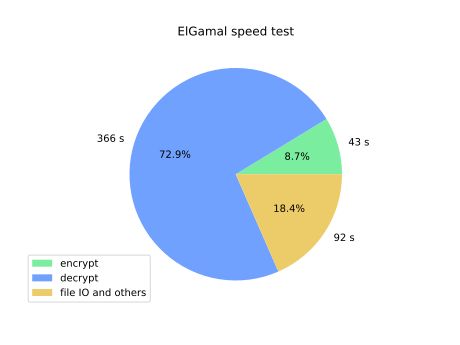

# 一、实验目的

通过本次实验，完成下列目标：

实现ElGamal算法的加解密过程，包括：
- 利用ElGamal加密体制加密任意128比特的消息
- 为素性检测、ElGamal加解密过程编写独立模块，在主函数中通过头文件调用
- 大素数$p$为安全素数，即$p=2q+1$
- 测试ElGamal算法的执行效率
- 对某文本数据文件加密，密文输出到文件
- ElGamal算法优化实现，提高加解密速度
- 编程实现离散对数的求解算法，包括Shanks算法和Pohlig-Hellman算法

ElGamal算法的安全性分析，包括：
- 编程实现离散对数的求解算法
    - Shanks算法
    - Pohlig-Hellman算法
- 挑战题：尝试求解如下离散对数问题
    - $p=813431819900321539$（60-bit素数）
    - 生成元$\alpha=3,\beta=233663611284485306$
    - 计算$a=\log_{\alpha}{\beta}$

# 二、实验原理

## 1. 原根相关结论说明

**数论讲义P134 定理1**
$$
设m>2，\phi(m)的所有不同的素因子是q_1,q_2,\cdots,q_s，(g,m)=1，则g是m的一个原根的充分必要条件是
g^{\frac{\phi(m)}{q_i}}\not\equiv1\bmod m
$$

对于安全素数$p$，其原根个数为$\phi(\phi(p))=\phi(p-1)=\phi(2a)=\phi(2)\phi(a)=a-1$，原根的密度大约为1/2

## 2. ElGamal算法

ElGamal加密算法是一个基于DH密钥交换的非对称加密算法，它在1985年由塔希尔·盖莫尔提出。ElGamal公开密钥密码体制是基于有限域中离散对数问题的难解性。它所根据的原理是：求解离散对数是困难的，而其逆运算可以应用平方乘的方法有效的计算出来。在相应的群G中，指数函数是单向陷门函数 。

### 2.1 密钥生成

1. 随机选取一个大素数$p$，为增强算法安全性，这里选取$p$为安全素数，然后
2. 选取群$(\mathbb{Z}_{p}^{*},\cdot)$的一个生成元（本原元）$\alpha$
3. 随机选取$a$，满足$1<a<p-1$
4. 计算$\beta \equiv {\alpha}^a \bmod p$

要求解群$(\mathbb{Z}_{p}^{*},\cdot)$的生成元$\alpha$，在$p$较大时遍历判断${\alpha}^k \not\equiv 1 \bmod p,1\le k \le \phi(p)-1$是否成立是很耗时的。特别地，由于实验中选取的$p=2a+1$为安全素数，根据上述有关原根的结论，只需要进行如下判断
$$
\alpha是群(\mathbb{Z}_{p}^{*},\cdot)的生成元当且仅当
\left\{
\begin{aligned}
{\alpha}^2 \not \equiv 1 \bmod p \\
{\alpha}^a \not \equiv 1 \bmod p
\end{aligned}
\right.
成立
$$

由此得到全部的密钥信息如下：

- 公钥：$p,\alpha,\beta$，其中$p,\alpha$可由一组用户共享
- 私钥：$p,\alpha,a,\beta$

### 2.2 ElGamal加密方式

对于明文$m$，若$m>p$，则对$m$模$p$对明文进行分组加密，因此下面只讨论$m<p$。

首先随机选取数$x(0<x<p)$，然后计算
$$
\left\{
\begin{aligned}
y_1 & \equiv {\alpha}^x & \bmod p \\
y_2 & \equiv m \cdot {\beta}^x & \bmod p\\
\end{aligned}
\right.
$$

那么密文如下
$$
c=E_k(m,x)=(y_1,y_2)
$$

### 2.3 ElGamal解密方式

对于密文$(y_1,y_2)$，用私钥$a$对解密的过程如下：
$$
m \equiv D_{a}(y_1,y_2) \equiv y_2(y_1^a)^{-1} \bmod p
$$

正确性可以简证如下：
$$
y_2(y_1^a)^{-1} \equiv m \cdot {\beta}^{x}({\alpha}^{ax})^{-1} \equiv m \bmod p
$$
## 3. ElGamal安全性分析

如果攻击者可以计算$a=\log_{\alpha}{\beta}$，那么ElGamal公钥密码体制就是不安全的，因此ElGamal公钥密码体制安全的一个必要条件就是$\mathbb{Z}_{p}^{*}$上的离散对数是难处理的。

### 3.1 Shanks算法

这是一个非平凡的时间-存储平衡算法，流程如下：

1. 令$m=\lceil \sqrt{n} \rceil$，其中$n=\left|G(\mathbb{Z}_{p}^{*},\cdot)\right|=p-1$
2. 对于$j=0,\cdots,m-1$，计算${\alpha}^{mj}$，并将有序对$(j,{\alpha}^{mj})$添加到表$L_1$中
3. 按${\alpha}^{mj}$的大小对$L_1$中的有序对排序
4. 对于$i=0,\cdots,m-1$，计算$\beta{\alpha}^{-i}$，并将有序对$(i,\beta{\alpha}^{-i})$添加到表$L_2$中
5. 按$\beta{\alpha}^{-i}$的大小对$L_2$中的有序对排序
6. 找到第二坐标相同的有序对$(j,y)\in L_1,(i,y)\in L_2$
7. 计算$a=\log_{\alpha}{\beta}\equiv mj+i \bmod n$

### 3.2 Pohlig-Hellman算法

设有标准分解$n=p-1={\prod}_{i=1}^{k}{p_i^{c_i}}$。由于$a=\log_{\alpha}{\beta}$是由$n$唯一确定的，如果能够对于每个$i(1\le i \le k)$，计算出$a (\bmod p_i^{c_i})$，就可以利用中国剩余定理计算出$a \bmod n$。

对于某个素数$p_r$，求解$a(\bmod p_r^{c_r})={\sum}_{i=0}^{c_r-1}{a_iq_r^i}$，等价于求解每个$a_j,0\le j \le c_r-1$，流程如下：

首先令$\beta_0=\beta$，对于$\beta_j(0\ < j \le c_r-1)$使用如下等式递归构造构造
$$
\beta_{j+1}=\beta{\alpha}^{-(a_0+a_1q_r\cdots+a_jq_r^j)}={\beta}_j{\alpha}^{-(a_jq^j)} \qquad (\bmod p)
$$

那么求解$\beta_{j+1}$等价于求解$a_j$，而对于每个$\beta_j(0\le j \le c_r-1)$，可以证明下面的等式成立
$$
{\beta}_j^{n/q^{j+1}}={\alpha}^{a_jn/q} \qquad (\bmod p)
$$

那么求解$a_j$等价于求解$\beta_j$，由此我们确定了各个未知量的求解顺序如下
$$
\beta_0 \rightarrow a_0 \rightarrow \beta_1 \rightarrow a_1 \rightarrow \cdots \rightarrow \beta_{c_r-1} \rightarrow a_{c_r-1}
$$

而根据条件，我们有$\beta_0=\beta$，带入上面的求解顺序链，即可求得各未知量的值。$\square$

在上面的流程中，我们已经知道了$a(\bmod p_r^{c_r})$，利用中国剩余定理，容易得到$a(\bmod n)$。

# 三、实验内容

## 1. 函数优化实现

在RSA实验中，我们已经实现和优化实现了对下列函数，本次实验直接调用

- `custom_gcd`模块
    - 欧几里得和二进制欧几里得算法
    - 扩展欧几里得和二进制扩展欧几里得算法
- `primality_test`模块
    - 快速模幂算法
    - *Miller-Rabin*素性测试算法
    - 随机素数（包括安全素数）生成

## 2. 原根判别和生成

在原理部分，我们已经知道对于安全素数$p$，其原根的密度大约为1/2，因此如果我们在$2 \sim p-1$的范围内随机选取整数，很容易取到原根，所以在程序中之间使用`randint`生成随机数并判断是否为原根。

下面给出判断一个整数`k`是否为安全素数`p`原根的算法

```python
def is_primitive_root(k, p) -> bool:
    a = (p - 1) // 2
    if quick_mod(k, 2, p) == 1:
        return False
    elif quick_mod(k, a, p) == 1:
        return False
    else:
        return True
```

## 3. ElGamal参数生成

首先指定ElGamal中参数$p$的比特长度`nbits`，根据其值，其余参数生成如下：

```python
self.p = get_random_prime(nbits)
self.alpha = randint(2, self.p - 1)
while not is_primitive_root(self.alpha, self.p):
    self.alpha = randint(2, self.p - 1)
self.a = randint((self.p - 1) // 2, self.p - 1)
self.beta = quick_mod(self.alpha, self.a, self.p)
```

参考示例

```python
e = ElGamal(nbits=128)  # 随机生成128比特的p
```

为保证安全性，`get_random_prime`函数生成的素数都是安全素数，$a$的取值也要求不小于$p$的一半。

同时也给出了使用密钥对信息构造ElGamal实例的方法，具体参考代码文件，这里给出使用示例

```python
e = ElGamal(key_info={'p': 2579, 'alpha': 2, 'a': 765, 'beta': 949})  # 可以用于加解密
e = ElGamal(key_info={'p': 2579, 'alpha': 2, 'beta': 949}, only_encrypt=True)  # 仅能用于加密
```

## 4. 加解密过程实现

有了以上功能的实现，依据ElGamal算法加解密原理，加解密的实现已经非常简洁

```python
def encrypt(self, message) -> tuple:
    x = randint(2, self.p - 1)
    y1 = quick_mod(self.alpha, x, self.p)
    y2 = message * quick_mod(self.beta, x, self.p) % self.p
    return y1, y2

def decrypt(self, ciphertext: tuple):
    if self.a is None:
        print('no private key')
        return None
    if len(ciphertext) != 2:
        print('incomplete ciphertext pair')
        return None
    y1 = ciphertext[0]
    y2 = ciphertext[1]
    # reference: ext_gcd(a,b) -> (gcd(a,b), s, t) which satisfies as+bt=gcd(a,b)
    tmp = ext_gcd(quick_mod(y1, self.a, self.p), self.p)[1]
    message = y2 * tmp % self.p
    return message
```

也可以使用文本文件形式实现加解密。下面的样例并不要求文本的编码格式，因为在读取和写回明文信息时使用二进制的方式进行。

该样例中，首先以二进制形式读取了`example.txt`中的明文文本，并加密后输出密文信息到`ciphertext.txt`；解密时从`ciphertext.txt`读取了密文信息，解密后把明文信息以二进制形式写入到`message.txt`。加解密流程完成后，比较`example.txt`和`message.txt`文件内容是一致的，验证了加解密算法的正确性。

```python
# 加密
with open('example.txt', 'rb') as plaintext:
    plain_data = plaintext.read()
    plain_data_int = int.from_bytes(plain_data, byteorder='little', signed=False)
with open('ciphertext.txt', 'w') as f:
    while plain_data_int != 0:
        plain_data_block = plain_data_int % p
        plain_data_int //= p
        t = time()
        cipher_data = e.encrypt(plain_data_block)
        encrypt_time += time() - t
        f.write(str(cipher_data[0]) + ' ' + str(cipher_data[1]) + '\n')
# 解密
plain_data_int = 0
k = 0
with open('ciphertext.txt', 'r') as f:
    cipher_data = f.readline()[:-1].split(' ')
    while cipher_data != ['']:
        y1, y2 = int(cipher_data[0]), int(cipher_data[1])
        t = time()
        plain_data_int += e.decrypt((y1, y2)) * p ** k
        decrypt_time += time() - t
        k += 1
        cipher_data = f.readline()[:-1].split(' ')
with open('message.txt', 'wb') as f:
    f.write(int(plain_data_int).to_bytes(length=int(ceil(len(hex(plain_data_int)[2:])/2)), byteorder='little'))
```

## 5. Shanks算法实现和优化

在 Python 中，字典 (Dictionary) 是一种具有快速查找速度的数据结构，它可以在常数时间复杂度的时间内从字典中查找特定的键值对应的值。具体来说，字典使用哈希表实现，其 key-value 对中的 key 值被用于计算哈希值，通过哈希函数将其映射到相应的桶中。因此，在没有哈希冲突的情况下，字典的查找时间为 O(1)；在最坏情况下，所有 key 都会被哈希到同一个桶中，导致查找时需要遍历所有的 key 才能找到所需值，此时查找时间复杂度为 O(n)，其中 n 是字典中 key 的数量。

综上所述，字典（Dictionary）的查找时间的期望时间复杂度是 O(1)，但在最坏情况下时间复杂度为 O(n)。

在Shanks算法中，需要比较$L_1,L_2$中的元素找到相同的有序对，为节省时间，下面的程序使用字典类型存储了$L_1$，键值为${\alpha}^{mj}$，在计算$\beta{\alpha}^{-i}$时可以直接用其值作为键值进行查找比较，也无须对$L_1$进行排序。

```python
def shanks(key_info):
    p = key_info['p']
    alpha = key_info['alpha']
    beta = key_info['beta']
    m = int(ceil(sqrt(p - 1)))
    l1 = []
    alpha_m = powmod(alpha, m, p)  # 预计算，加速
    for j in range(m):
        l1.append([powmod(alpha_m, j, p), j])  # 为方便使用键值查找，这里反转两个值的位置
    dict_l1 = dict(l1)
    pos_i = 0
    pos_j = 0
    for i in range(m):
        val = powmod(alpha, -i, p) * beta % p
        pos_j = dict_l1.get(val)
        if pos_j is not None:
            pos_i = i
            break
    a = (m * pos_j + pos_i) % (p - 1)
    return a
```

## 6. Pohlig-Hellman算法实现

中国剩余定理解同余式组的函数实现如下

```python
def CRT(nums, mods):
    """
    使用中国剩余定理（CRT）解决同余式组。
    nums：各个同余式中x的系数。
    mods：各个同余式中模数。
    返回同余方程组的唯一解。
    """
    # 计算模数之积，用于后面除法的计算。
    prod = 1
    for mod in mods:
        prod *= mod
    result = 0
    for num, mod in zip(nums, mods):
        # 计算 m 和 Mi
        m = prod // mod
        Mi = pow(m, -1, mod)
        # 计算结果
        result += num * m * Mi
    return result % prod
```

Pohlig-Hellman算法实现如下

```python
def pohlig_hellman(key_info):
    p = key_info['p']
    n = p - 1
    fac_n = sieve_of_factors(n)
    alpha = key_info['alpha']
    beta = key_info['beta']
    num_CRT = []
    # P-H 算法核心
    for q in list(fac_n.keys()):
        c = fac_n.get(q)
        gamma = powmod(alpha, n // q, p)  # gamma = {\alpha}^{n/q}
        beta_j = beta  # initial \beta_0 = \beta
        a_mod_qc = 0
        for j in range(c):
            pow_value = n // q ** (j + 1)
            target = powmod(beta_j, pow_value, p)  # target = {\beta}_j^{n/q^{j+1}}
            a_j = 0
            while powmod(gamma, a_j, p) != target:
                a_j += 1
            a_mod_qc += a_j * q ** j
            beta_j = beta_j * powmod(alpha, -a_j * q ** j, p) % p
        num_CRT.append(a_mod_qc)
    # CRT解同余式组
    modulo_CRT = list(fac_n.keys())
    return CRT(num_CRT, modulo_CRT)
```

# 四、实验结果

## 1. Shanks算法验证

使用教材P247 **例6.13** 验证如下

```python
p = 809
alpha = 3
beta = 525
a = shanks({'p': p, 'alpha': alpha, 'beta': beta})  # a = 309
print('Shanks算法验证')
print({'p': p, 'alpha': alpha, 'beta': beta})
print('a: {}'.format(a))
print('alpha^a: {}'.format(powmod(alpha, a, p)))
```

结果如下

```python
Shanks算法验证
{'p': 809, 'alpha': 3, 'beta': 525}
a: 309
alpha^a: 525
```

## 2. Pohlig-Hellman算法验证和挑战题求解

使用实验指导文档中的数据验证Pohlig-Hellman算法如下

```python
p = 813431819900321539
alpha = 3
beta = 233663611284485306
a = pohlig_hellman({'p': p, 'alpha': alpha, 'beta': beta})
print('Pohlig-Hellman算法验证')
print({'p': p, 'alpha': alpha, 'beta': beta})
print('a: {}'.format(a))
print('alpha^a: {}'.format(powmod(alpha, a, p)))
```

结果如下

```python
{'p': 813431819900321539, 'alpha': 3, 'beta': 233663611284485306}
a: 269376001743594218
alpha^a: 233663611284485306
```

## 3. 加解密验证和程序效率分析

### 3.1 128比特随机消息加解密

随机生成129比特的$p$和128比特的消息$r$，加密$r$得到密文$c$，解密$c$得到明文$m$，对比$r$和$m$验证正确性。

```python
e = ElGamal(nbits=129)
r = randint(2**128, 2**129-1)
c = e.encrypt(r)
m = e.decrypt(c)
print('ciphertext pair: {}'.format({'y1': hex(c[0]), 'y2': hex(c[1])}))
print('message recovered from ciphertext: {}'.format(hex(m)))
```

得到结果如下

```python
random 128 bits message: 0x11f23df85a652529ef5b0fc3f75365cd9
ciphertext pair: {'y1': '0x84a75fde1fad32cbda373f2ece7de658', 'y2': '0xcd07205f8a440b1fd976634912d6640e'}
message recovered from ciphertext: 0x11f23df85a652529ef5b0fc3f75365cd9
```

### 3.2 文本文件加解密

考虑到ElGamal的实际应用场景多是对称密钥的交换，文本长度在KB量级，这里节选了来自NIST语料库的部分文本文件进行加解密并计算ElGamal计算效率。上面已经给出了从文本读取和写入的样例，下面展示了明文文件内容的节选和密文文件的节选。

原始明文文件内容/从密文恢复的明文文件内容节选，`Article247_40.txt`

```python
            All the King's Men

            In the September Vanity Fair , profiler Marjorie Williams offers this
tasty Larry King anecdote:

            "One of the most oft told of the Larry Stories that circulate at CNN
concerns his take-out order when he eats dinner at his desk, before the show.
His favorite dish, from a local Chinese restaurant, is a chicken with
cashews--without the fat-laden cashews. When the food arrives, a young intern
or production assistant is charged with combing through it to remove any errant
nuts; then he or she has to swaddle the chicken in paper towels and squeeze out
any excess oil."
......
```

对应密文文件内容节选

```python
180020821313928757902389002802296738190 262505166323280389016945245265286930290
85996050453725424006247156010312440654 248112497407940722501913222066890592281
7543805574062840554010480833934676456 145284685788478073132097732368065786132
131210310334263553146033201074379662923 259057058465881097471003597425220600921
387958744281245860124531958389843194 163307480133139690060682634513657699392
34326478740614019172965275485442187302 260167631671217467647009760199601660370
108276309601069429595592355623062403288 186526964056225128968356359902032629959
76039162393250965824631223917779379788 57999070113753233391225010770993992800
...... ......
```

### 3.3 效率分析

使用文本文件加解密的方式，处理了5431个文件，总大小27,369,401字节，平均单个文件大小在6KB左右，分析如下：


测试时使用128比特从$p$，各项耗时占比如下图所示，发现尽管有优化，但是解密仍然非常困难且耗时，根据耗时数据可以估算该长度下加解密效率

- 加密 610.83 KB/s
- 解密 72.924 KB/s



# 五、心得体会

本次对ElGamal算法实现和优化的实验经历让我对ElGamal算法的过程和应用也有了更深层次的理解掌握。

在之前理论学习的时候，我们了解到了ElGamal算法的加解密的设计和实现过程，但是对其中设计细节和算法安全性不甚理解。此次实践中，对ElGamal加密算法的核心功能进行了复现，更加深入的认识到其设计原理，提高了理解程度。在对典型攻击实现的过程中，让我了解到ElGamal算法不合理的参数设置导致的潜在安全隐患；同时，在对ElGamal算法的优化过程中，加深了对已经学过的知识的理解和应用。

在完成实践的过程中，也遇到了一些不足和实现难点。例如在编写Pohlig-Hellman算法时，由于无法直观理解教材上的描述，导致在实现过程中陷入困境，在自行梳理且编制流程图，最终多次排查后完成了编写工作。