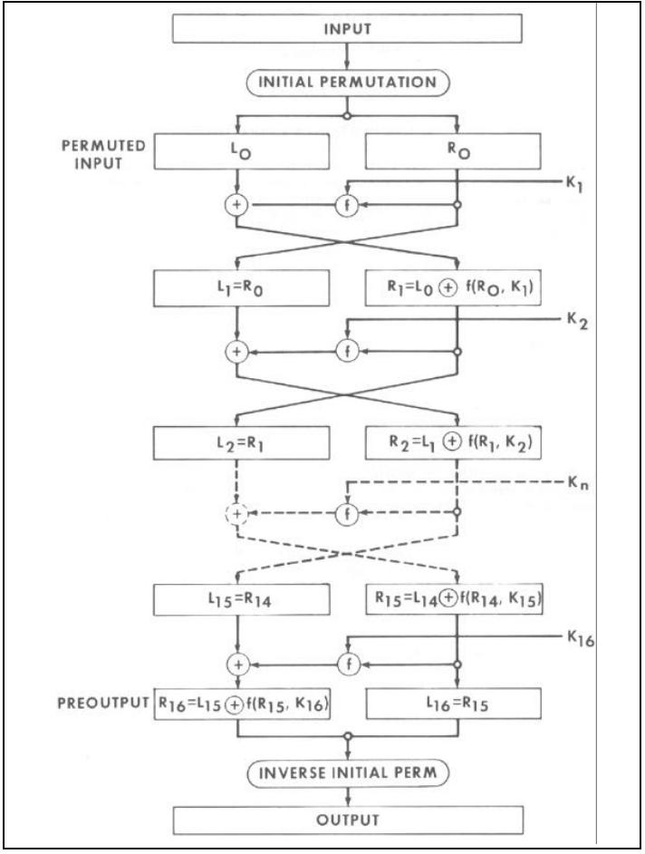
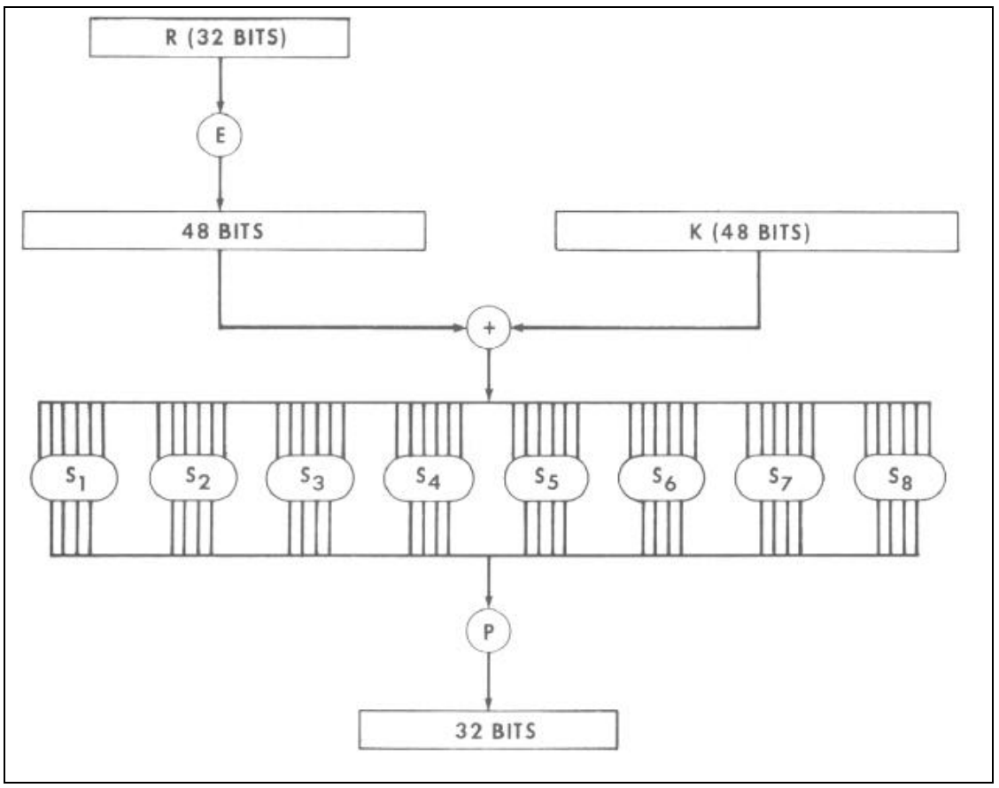
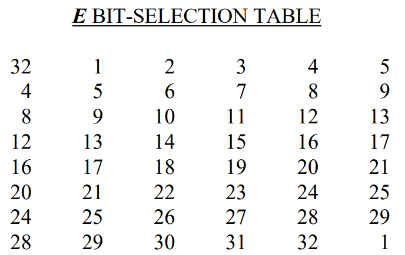
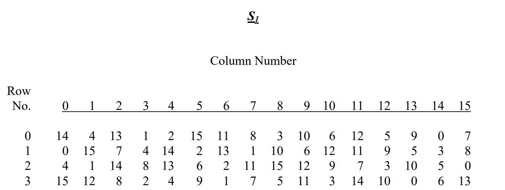
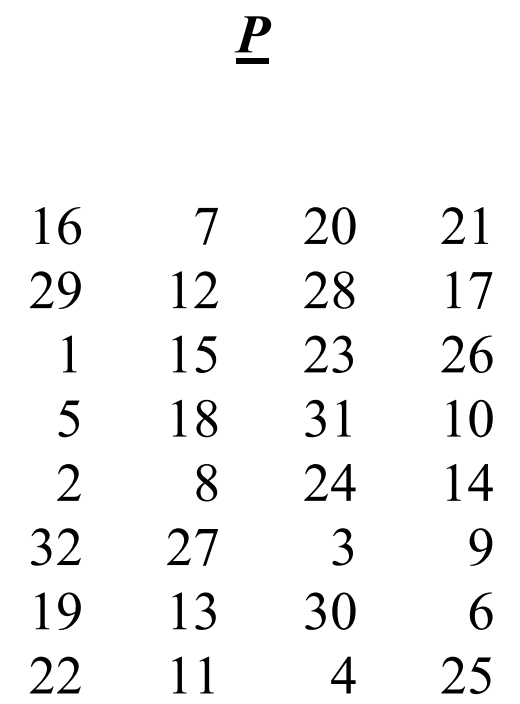
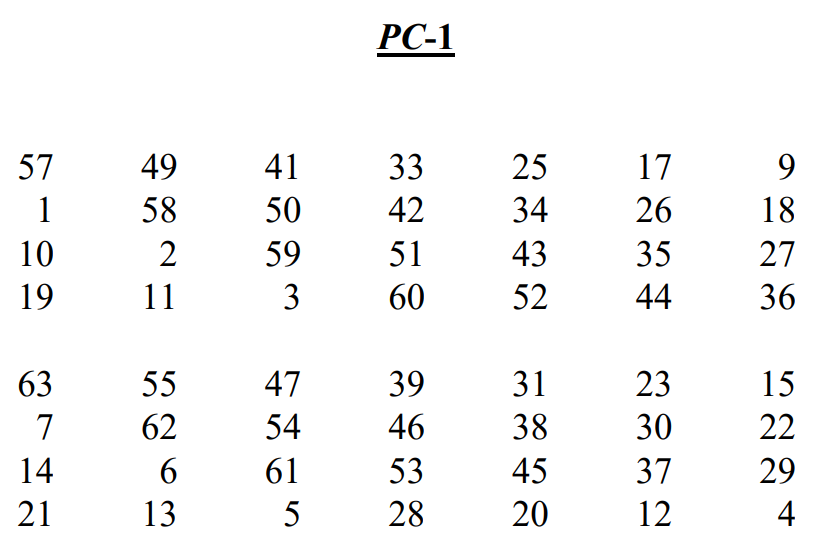
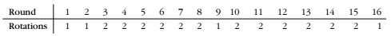
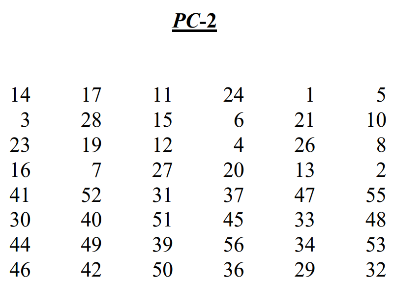

# 一、实验原理

## 1. DES算法介绍

### 1.1 DES算法简介

DES是一种分组密码算法。它是一个16轮的Feistel型密码，分组长度为64比特，即用一个64比特的种子密钥（有效位为56位）来加密一个64比特的明文串，并获得一个64比特的密文串。



### 1.2 Feistel结构介绍

在一个Feistel型结构中，每一个状态都被分成相同长度的两部分$L_i$和$R_i$，轮函数具有以下形式：
$$
g(L_{i-1},R_{i-1},K_i)=(L_i,R_i)
$$
其中
$$
L_i=R_{i-1},R_i=L_{i-1}\oplus f(R_{i-1},K_i)
$$
我们注意到，这里函数$f$并不需要满足任何可逆的条件。

### 1.3 轮函数介绍

在图1中我们看到，函数
$$
f:\{0,1\}^{32}\times\{0,1\}^{48}\rightarrow\{0,1\}^{32}
$$
的输入是一个32比特的串和轮密钥，其中轮密钥是由种子密钥导出生成的48比特串。下图给出了具体结构，它主要包含一个非线性的S盒代换和一个固定置换$P$：



计算$f(X_i,K_i)$的过程如下：

1. 根据一个固定的扩展函数$E$，将$X_i$扩展成一个长度为48比特的串

2. 计算$E(X_i)\oplus K_i$，并将结果写成8个6比特串的级联 $B=B_1B_2B_3B_4B_5B_6B_7B_8$

3. 使用8个S盒$S_1$，$S_2$，$S_3$，$S_4$，$S_5$，$S_6$，$S_7$，$S_8$，其中$S_i:\{0,1\}^6\rightarrow\{0,1\}^4$

4. 根据置换$P$，对32比特串$C=C_1C_2C_3C_4C_5C_6C_7C_8$作置换，所得结果$P(C)$就是$f(X_i,K_i)$。

#### 1.3.1 扩展运算$E$

扩展运算$E$定义为：一个以32比特为输入，以48比特为输出的函数。将32比特的输入从左到右给定坐标1-32，将其输出的48比特写成8块，每块6比特，通过按下表顺序选择其输入中对应坐标的比特得到：



#### 1.3.2 S盒变换

S盒是一个非线性代换网络，下面以$S_1$盒为例，给出使用方法。如果$S_1$的输入6比特为$z_0z_1z_2z_3z_4z_5$，则$z_0z_5$的十进制表示表$S_1$的行数，$z_1z_2z_3z_4$的十进制表示表$S_1$的列数，查表得到的值的二进制即为S盒的输出。



#### 1.3.3 置换运算$P$

置换运算$P$是对S盒输出32比特数据的坐标变换，变换规则由下表定义：



### 1.4 密钥扩展算法

DES共有16轮迭代，每轮迭代要使用一个子密钥$K_i(1\le i\le 16)$。DES将初始密钥中第8，16，24，32，40，48，56，64比特（作为校验位）去掉后，经过置换选择PC-1，左循环移位和置换选择PC-2给出每轮迭代加密用的子密钥$K_i$。每个子密钥$K_i(1\le i\le 16)$的产生过程是一样的，不同之处是左循环移位数不相同。

#### 1.4.1 种子密钥校验位

DES密钥使用奇校验（odd parity），即一个字节的高7比特中，如果“1”的数量为奇数，则校验位为0；如果“1”的数量为偶数，则校验位为“1”。（也可以理解为：一个字节全部8个比特——也就是包括了校验位，“1”的数量必须为奇数。）

#### 1.4.2 PC-1置换

如果初始密钥$K$的坐标$1,2,\cdots,64$依次表示初始密钥的64比特$k_1,k_2,\cdots,k_{64}$，则
$$
PC-1(K)=(C_0,D_0)
$$

其中$C_0,D_0$由下表的上下两部分分别给出：



#### 1.4.3 左循环移位

按下表给出的移位数分别对$C_0,D_0$进行左循环移位，得到的56比特数据记为$h=(h_1,h_2,\cdots,h_{56})$



#### 1.4.4 PC-2置换

按下表对$h=(h_1,h_2,\cdots,h_{56})$进行坐标变换，注意**$h$有56个分量，而$PC-2(h)$只有48个分量**，这是因为在作置换时去掉了$h$的第9，18，22，25，35，38，43，54位。



## 2. 差分攻击介绍

### 2.1 差分攻击简介

差分密码分析是一种选择明文攻击，是分组密码分析的重要方法之一，也是理论分析密码算法和算法抗攻击测试的重要依据之一。

本次实验是对三轮DES简化算法的差分分析，通过下表三组明密文对（每组两个相关明文和相应密文），利用差分分析原理提取算法的种子密钥。

|      明 文       |      密 文       |
| :--------------: | :--------------: |
| 748502CD38451097 | 03C70306D8A09F10 |
| 3874756438451097 | 78560A0960E6D4CB |
| 486911026ACDFF31 | 45FA285BE5ADC730 |
| 375BD31F6ACDFF31 | 134F7915AC253457 |
| 357418DA013FEC86 | D8A31B2F28BBC5CF |
| 12549847013FEC86 | 0F317AC2B23CB944 |

不考虑初始置换$IP$和$IP^{-1}$，假设3轮DES算法的两个明密文对$m=L_0R_0,m^*=L_0^*R_0^*;c=L_3R_3,c^*=L_3^*R_3^*$:

### 2.2 计算S盒差分

S盒输入和输出差分的计算过程:

$$
\begin{array}{l}
R_{3}=L_{2} \oplus f\left(R_{2}, k_{3}\right)=R_{1} \oplus f\left(R_{2}, k_{3}\right)=L_{0} \oplus f\left(R_{0}, k_{1}\right) \oplus f\left(R_{2}, k_{3}\right), \\
R_{3}^{*}=L_{0}^{*} \oplus f\left(R_{0}^{*}, k_{1}\right) \oplus f\left(R_{2}^{*}, k_{3}\right),
\end{array}
$$

令：
$$
\quad L_{0}^{\prime}=L_{0} \oplus L_{0}^{*},R_{3}^{\prime}=R_{3} \oplus R_{3}^{*}=L_{0}^{\prime} \oplus f\left(R_{0}, k_{1}\right) \oplus f\left(R_{0}^{*}, k_{1}\right) \oplus f\left(R_{2}, k_{3}\right) \oplus f\left(R_{2}^{*}, k_{3}\right)
$$

观察可得在本次实验原始数据中, 明文对满足

$$
{R}_{0}={R}_{0}^{*} \text { ，即 } {R}_{0}^{\prime}={R}_{0} \oplus R_{0}^{*}=00000000 \text {. }
$$

则

$$
R_{3}^{\prime}=R_{3} \oplus R_{3}^{*}=L_{0}^{\prime} \oplus f\left(R_{2}, k_{3}\right) \oplus f\left(R_{2}^{*}, k_{3}\right)
$$
同时有
$$
m=L_{0} R_{0}, m^{*}=L_{0}^{*} R_{0}^{*} ; R_{2}=L_{3}, R_{2}^{*}=L_{3}^{*} \text {, }
$$

可计算出:  $L_{0}^{\prime}=L_{0} \oplus L_{0}^{*}, R_{3}^{\prime}=R_{3} \oplus R_{3}^{*}, f\left(R_{2}, k_{3}\right) \oplus f\left(R_{2}^{*}, k_{3}\right)=R_{3}^{\prime} \oplus L_{0}^{\prime} .$

则可计算得出:

第3轮S盒输入差：$\left(E\left(R_{2}\right) \oplus k_{3}\right) \oplus\left(E\left(R_{2}^{*}\right) \oplus k_{3}\right)=E\left(L_{3}\right) \oplus E\left(L_{3}^{*}\right)$（已知）；

第3轮S盒输出差：$D \oplus D^{*}=P^{-1}\left(R_{3}^{\prime} \oplus L_{0}^{\prime}\right)$（据已知条件可计算）。

### 2.3 利用差分求解第3轮子密钥

令：
$$
\begin{aligned}
& E\left(L_{3}\right) \oplus E\left(L_{3}^{*}\right)=B_{1} B_{2} B_{3} B_{4} B_{5} B_{6} B_{7} B_{8}, \\
& P^{-1}\left(R_{3}^{\prime} \oplus L_{0}^{\prime}\right)=C_{1} C_{2} C_{3} C_{4} C_{5} C_{6} C_{7} C_{8}, \\
& E\left(L_{3}\right)=A_{1} A_{2} A_{3} A_{4} A_{5} A_{6} A_{7} A_{8}, \\
& k_{3}=J_{1} J_{2} J_{3} J_{4} J_{5} J_{6} J_{7} J_{8}, \\
& E\left(L_{3}\right) \oplus k_{3}=X_{1} X_{2} X_{3} X_{4} X_{5} X_{6} X_{7} X_{8}, \\
& E\left(L_{3}^{*}\right) \oplus k_{3}=Y_{1} Y_{2} Y_{3} Y_{4} Y_{5} Y_{6} Y_{7} Y_{8},
\end{aligned}
$$

分析上面公式，我们可以发现对于正确的$J_i(1\le i\le 8)$，需要满足要求
$$
X_i\oplus Y_i=B_i,S_i(X_i)\oplus S(Y_i)=C_i\quad i=1,2,\cdots,8
$$
因此可以用以下方法确定$J_i(1\le i\le 8)$：

1. 构造一个64长度的计数器$J_i[64]={0}$
2. 对于3组明文对，分别使用密钥$k_{i_j}$测试确定是否满足上述要求，使$J_i[k_{i_j}]=满足的对数$
3. 若$J_i[k_{i_j}]=3$，则6比特串$k_{i_j}$就是可能的密钥比特$J_i$

### 2.4 恢复种子密钥

根据上步结果，得到第3轮使用的48比特子密钥$k_{3}=J_{1} J_{2} J_{3} J_{4} J_{5} J_{6} J_{7} J_{8}$，根据PC-2选择置换的逆变换还原48比特子密钥在56比特中位置（缺省8比特空出），再通过右循环移位还原56比特初始密钥。

至此，我们对56比特初始密钥中未知的8比特进行穷举，使用6个明密文对进行简化的3轮加密进行测试，最终确定56比特初始密钥。

最后，对56比特初始密钥的每7位计算校验位得到64比特种子密钥。

# 二、实验方案

本次实验采用`Python`编写，为便于直接从数学描述转化为代码实现以及加快运算速度，各模块间的数据传递主要使用整型`Int`，模块内部实现主要采用移位运算。

## 1. DES加密算法的实现

### 1.1 轮加密相关的函数实现

#### 1.1.1 明文扩展函数$E$

##### 接口说明

函数接受32比特的明文数据输入，根据扩展表得到48比特的扩展明文数据并返回

##### 实现代码

```python
def E(message: int) -> int:
    e_table = [32, 1, 2, 3, 4, 5,
               4, 5, 6, 7, 8, 9,
               8, 9, 10, 11, 12, 13,
               12, 13, 14, 15, 16, 17,
               16, 17, 18, 19, 20, 21,
               20, 21, 22, 23, 24, 25,
               24, 25, 26, 27, 28, 29,
               28, 29, 30, 31, 32, 1]
    extend = 0
    for e in e_table:
        extend = extend << 1
        extend += (message & (0b1 << (32 - e))) >> (32 - e)
    return extend
```

#### 1.1.2 S盒变换函数

##### 接口说明

`S`函数接受48比特的数据输入，返回32比特经过8个S盒变换后的数据

同时我们也给出了单个S盒变换的函数`S_i`，该函数接受6比特的数据且需要指定对应的S盒，返回4比特单个S盒变换后的数据

##### 实现代码

```python
def S(data: int) -> int:
    s1 = [14, 4, 13, 1, 2, 15, 11, 8, 3, 10, 6, 12, 5, 9, 0, 7,
          0, 15, 7, 4, 14, 2, 13, 1, 10, 6, 12, 11, 9, 5, 3, 8,
          4, 1, 14, 8, 13, 6, 2, 11, 15, 12, 9, 7, 3, 10, 5, 0,
          15, 12, 8, 2, 4, 9, 1, 7, 5, 11, 3, 14, 10, 0, 6, 13]
    s2 = [15, 1, 8, 14, 6, 11, 3, 4, 9, 7, 2, 13, 12, 0, 5, 10,
          3, 13, 4, 7, 15, 2, 8, 14, 12, 0, 1, 10, 6, 9, 11, 5,
          0, 14, 7, 11, 10, 4, 13, 1, 5, 8, 12, 6, 9, 3, 2, 15,
          13, 8, 10, 1, 3, 15, 4, 2, 11, 6, 7, 12, 0, 5, 14, 9]
    s3 = [10, 0, 9, 14, 6, 3, 15, 5, 1, 13, 12, 7, 11, 4, 2, 8,
          13, 7, 0, 9, 3, 4, 6, 10, 2, 8, 5, 14, 12, 11, 15, 1,
          13, 6, 4, 9, 8, 15, 3, 0, 11, 1, 2, 12, 5, 10, 14, 7,
          1, 10, 13, 0, 6, 9, 8, 7, 4, 15, 14, 3, 11, 5, 2, 12]
    s4 = [7, 13, 14, 3, 0, 6, 9, 10, 1, 2, 8, 5, 11, 12, 4, 15,
          13, 8, 11, 5, 6, 15, 0, 3, 4, 7, 2, 12, 1, 10, 14, 9,
          10, 6, 9, 0, 12, 11, 7, 13, 15, 1, 3, 14, 5, 2, 8, 4,
          3, 15, 0, 6, 10, 1, 13, 8, 9, 4, 5, 11, 12, 7, 2, 14]
    s5 = [2, 12, 4, 1, 7, 10, 11, 6, 8, 5, 3, 15, 13, 0, 14, 9,
          14, 11, 2, 12, 4, 7, 13, 1, 5, 0, 15, 10, 3, 9, 8, 6,
          4, 2, 1, 11, 10, 13, 7, 8, 15, 9, 12, 5, 6, 3, 0, 14,
          11, 8, 12, 7, 1, 14, 2, 13, 6, 15, 0, 9, 10, 4, 5, 3]
    s6 = [12, 1, 10, 15, 9, 2, 6, 8, 0, 13, 3, 4, 14, 7, 5, 11,
          10, 15, 4, 2, 7, 12, 9, 5, 6, 1, 13, 14, 0, 11, 3, 8,
          9, 14, 15, 5, 2, 8, 12, 3, 7, 0, 4, 10, 1, 13, 11, 6,
          4, 3, 2, 12, 9, 5, 15, 10, 11, 14, 1, 7, 6, 0, 8, 13]
    s7 = [4, 11, 2, 14, 15, 0, 8, 13, 3, 12, 9, 7, 5, 10, 6, 1,
          13, 0, 11, 7, 4, 9, 1, 10, 14, 3, 5, 12, 2, 15, 8, 6,
          1, 4, 11, 13, 12, 3, 7, 14, 10, 15, 6, 8, 0, 5, 9, 2,
          6, 11, 13, 8, 1, 4, 10, 7, 9, 5, 0, 15, 14, 2, 3, 12]
    s8 = [13, 2, 8, 4, 6, 15, 11, 1, 10, 9, 3, 14, 5, 0, 12, 7,
          1, 15, 13, 8, 10, 3, 7, 4, 12, 5, 6, 11, 0, 14, 9, 2,
          7, 11, 4, 1, 9, 12, 14, 2, 0, 6, 10, 13, 15, 3, 5, 8,
          2, 1, 14, 7, 4, 10, 8, 13, 15, 12, 9, 0, 3, 5, 6, 11]
    sbox = [s1, s2, s3, s4, s5, s6, s7, s8]
    out = 0
    for i in range(8):
        z = (data & (0xfc0000000000 >> (6 * i))) >> (42 - 6 * i)
        row = ((z & 0b100000) >> 4) + (z & 0b1)
        col = ((z & 0b011110) >> 1)
        out = out << 4
        out += sbox[i][row * 16 + col]
    return out

def S_i(box_index: int, data: int) -> int:
    return (S(data << (48 - 6 * box_index)) >> (32 - 4 * box_index)) & 0b1111
```

#### 1.1.3 $P$置换函数

##### 接口说明

接受32比特经过S盒变换输出的数据，返回经过$P$置换后的32比特数据

##### 实现代码

```python
def P(data: int) -> int:
    p_table = [16, 7, 20, 21,
               29, 12, 28, 17,
               1, 15, 23, 26,
               5, 18, 31, 10,
               2, 8, 24, 14,
               32, 27, 3, 9,
               19, 13, 30, 6,
               22, 11, 4, 25]
    substitution = 0
    for p in p_table:
        substitution = substitution << 1
        substitution += (data & (0b1 << (32 - p))) >> (32 - p)
    return substitution
```

#### 1.1.4 $P^{-1}$置换函数

##### 接口说明

根据$P$置换表，我们可以构造其逆变换的置换表，并实现逆置换功能

接受32比特经过置换后的数据，返回其源数据，即S盒输出的数据

##### 实现代码

```python
def inv_P(substitution: int) -> int:
    inv_p_table = [9, 17, 23, 31,
                   13, 28, 2, 18,
                   24, 16, 30, 6,
                   26, 20, 10, 1,
                   8, 14, 25, 3,
                   4, 29, 11, 19,
                   32, 12, 22, 7,
                   5, 27, 15, 21]
    data = 0
    for inv_p in inv_p_table:
        data = data << 1
        data += (substitution & (0b1 << (32 - inv_p))) >> (32 - inv_p)
    return data
```

#### 1.1.5 $f$函数

##### 接口说明

轮函数$f$是对明文扩展函数$E$，S盒变换函数和$P$置换函数的封装

函数接受在Feistel型的一轮加密中输入的右32比特明文$R_i$和48比特的轮子密钥，返回32比特数据

##### 实现代码

```python
def f(message: int, round_key: int) -> int:
    s_in = E(message) ^ round_key
    s_out = S(s_in)
    return P(s_out)
```

#### 1.1.6 轮加密函数

##### 接口说明

轮加密函数是对$f$函数的封装以实现一轮Feistel型加密过程

函数接受64比特的明文数据和48比特的轮子密钥数据输入，返回一轮加密后的64比特密文数据

##### 实现代码

```python
def encrypt_round(message: int, round_key: int) -> int:
    l_message = message >> 32
    r_message = message & 0xffffffff
    l_cipher = r_message
    r_cipher = l_message ^ f(message=r_message, round_key=round_key)
    return (l_cipher << 32) + r_cipher
```

### 1.2 密钥扩展相关的函数实现

#### 1.2.1 PC-1置换函数

##### 接口说明

函数接受64比特的种子密钥数据，返回经过PC-1置换的56比特初始密钥

##### 实现代码

```python
def pc_1(key: int) -> int:
    C0_table = [57, 49, 41, 33, 25, 17, 9,
                1, 58, 50, 42, 34, 26, 18,
                10, 2, 59, 51, 43, 35, 27,
                19, 11, 3, 60, 52, 44, 36]
    D0_table = [63, 55, 47, 39, 31, 23, 15,
                7, 62, 54, 46, 38, 30, 22,
                14, 6, 61, 53, 45, 37, 29,
                21, 13, 5, 28, 20, 12, 4]
    C0 = 0
    D0 = 0
    for c in C0_table:
        C0 = C0 << 1
        C0 += (key & (0b1 << (64 - c))) >> (64 - c)
    for d in D0_table:
        D0 = D0 << 1
        D0 += (key & (0b1 << (64 - d))) >> (64 - d)
    return (C0 << 28) + D0
```

#### 1.2.2 PC-1逆置换函数

##### 接口说明

该函数是PC-1置换的逆函数，输入数据为56比特初始密钥，返回输出为64比特种子密钥

由于PC-1置换是$\{0,1\}^{64}\rightarrow\{0,1\}^{56}$的映射，因此在做逆变换时，对于丢弃的位置我们首先使用0占位，然后根据DES种子密钥奇校验规则，恢复原64比特中的校验位`[8, 16, 24, 32, 40, 48, 56, 64]`

##### 实现代码

```python
def inv_pc_1(key_stream_initial: int) -> int:
    key_stream_initial = bin(key_stream_initial)[2:].zfill(56)
    seed_key_list = [0] * 64
    pc_1_table = [57, 49, 41, 33, 25, 17, 9,
                  1, 58, 50, 42, 34, 26, 18,
                  10, 2, 59, 51, 43, 35, 27,
                  19, 11, 3, 60, 52, 44, 36,
                  63, 55, 47, 39, 31, 23, 15,
                  7, 62, 54, 46, 38, 30, 22,
                  14, 6, 61, 53, 45, 37, 29,
                  21, 13, 5, 28, 20, 12, 4]
    for i in range(56):
        seed_key_list[pc_1_table[i] - 1] = int(key_stream_initial[i], base=2)
    # 校验位恢复
    for i in range(8):
        seed_key_list[8 * (i + 1) - 1] = (sum(seed_key_list[8 * i:8 * (i + 1) - 1]) + 1) % 2
    seed_key = sum([seed_key_list[i] << (63 - i) for i in range(64)])
    return seed_key
```

#### 1.2.3 左循环移位函数

##### 接口说明

接受56比特的初始密钥和加密轮次（范围为1-16，但在此次实验中只用到了前3轮），返回对应轮次需要的56比特密钥数据

##### 实现代码

```python
def shift_left(key: int, round_index: int) -> int:
    C0 = key >> 28
    D0 = key & 0xfffffff
    shift_table = [1, 1, 2, 2, 2, 2, 2, 2, 1, 2, 2, 2, 2, 2, 2, 1]
    shift_cnt = sum(shift_table[:round_index])
    C0 = ((C0 << shift_cnt) & 0xfffffff) + ((C0 << shift_cnt) >> 28)
    D0 = ((D0 << shift_cnt) & 0xfffffff) + ((D0 << shift_cnt) >> 28)
    return (C0 << 28) + D0
```

#### 1.2.4 左循环移位的逆移位函数

##### 接口说明

接受56比特的密钥数据和输入密钥对应的加密轮次（范围为1-16，但在此次实验中只用到了前3轮），返回56比特初始密钥数据

##### 实现代码

```python
def inv_shift_left(key: int, round_index: int) -> int:
    C0 = key >> 28
    D0 = key & 0xfffffff
    shift_table = [1, 1, 2, 2, 2, 2, 2, 2, 1, 2, 2, 2, 2, 2, 2, 1]
    shift_cnt = sum(shift_table[:round_index])
    C0 = (C0 >> shift_cnt) + ((C0 & ((1 << shift_cnt) - 1)) << (28 - shift_cnt))
    D0 = (D0 >> shift_cnt) + ((D0 & ((1 << shift_cnt) - 1)) << (28 - shift_cnt))
    return (C0 << 28) + D0
```

#### 1.2.5 PC-2置换函数

##### 接口说明

接受56比特的密钥数据，返回经过PC-2置换后的48比特轮密钥数据

##### 实现代码

```python
def pc_2(key: int) -> int:
    a1_table = [14, 17, 11, 24, 1, 5,
                3, 28, 15, 6, 21, 10,
                23, 19, 12, 4, 26, 8,
                16, 7, 27, 20, 13, 2]
    b1_table = [41, 52, 31, 37, 47, 55,
                30, 40, 51, 45, 33, 48,
                44, 49, 39, 56, 34, 53,
                46, 42, 50, 36, 29, 32]
    a1 = 0
    b1 = 0
    for a in a1_table:
        a1 = a1 << 1
        a1 += (key & (0b1 << (56 - a))) >> (56 - a)
    for b in b1_table:
        b1 = b1 << 1
        b1 += (key & (0b1 << (56 - b))) >> (56 - b)
    return (a1 << 24) + b1
```

#### 1.2.6 PC-2逆置换函数

##### 接口说明

PC-2置换的逆函数，由于PC-2置换是$\{0,1\}^{56}\rightarrow\{0,1\}^{48}$的映射，因此在做逆变换时，对于丢弃的位置先使用 0 占位，对于需要利用该函数结果的后续过程应当注意识别。而根据PC-2置换表丢弃的比特位，得到需要用0占位的位置为[9, 18, 22, 25, 35, 38, 43, 54]

##### 实现代码

```python
def inv_pc_2(round_key: int) -> int:
    round_key = bin(round_key)[2:].zfill(48)
    origin_key = ['0'] * 56
    pc_2_table = [14, 17, 11, 24, 1, 5,
                  3, 28, 15, 6, 21, 10,
                  23, 19, 12, 4, 26, 8,
                  16, 7, 27, 20, 13, 2,
                  41, 52, 31, 37, 47, 55,
                  30, 40, 51, 45, 33, 48,
                  44, 49, 39, 56, 34, 53,
                  46, 42, 50, 36, 29, 32]
    for i in range(48):
        origin_key[pc_2_table[i] - 1] = round_key[i]
    return int(''.join(origin_key), base=2)
```

#### 1.2.7 轮密钥获取函数

##### 接口说明

在此步骤中，通过对上面定义的函数进行不同程度的封装，我们定义了两种不同的获取轮密钥的函数：

- `get_round_key`函数能够直接从64比特的种子密钥和给出的加密轮次得到48比特的轮子密钥
- `get_round_key_from_initial_stream`函数能够从经过PC-1置换的56比特初始密钥和给出的加密轮次得到48比特的轮子密钥

##### 代码实现

```python
def get_round_key(seed_key: int, round_index: int) -> int:
    return pc_2(shift_left(pc_1(seed_key), round_index))


def get_round_key_from_initial_stream(key_stream_initial: int, round_index: int) -> int:
    return pc_2(shift_left(key_stream_initial, round_index))
```

## 2. 差分攻击相关代码的实现

### 2.1 计算S盒差分

首先我们给出了已知的明文对`message_pair`和密文对`ciphertext_pair`

```python
message_pair = [
    [0x748502CD38451097, 0x3874756438451097],
    [0x486911026ACDFF31, 0x375BD31F6ACDFF31],
    [0x357418DA013FEC86, 0x12549847013FEC86]
]
ciphertext_pair = [
    [0x03C70306D8A09F10, 0x78560A0960E6D4CB],
    [0x45FA285BE5ADC730, 0x134F7915AC253457],
    [0xD8A31B2F28BBC5CF, 0x0F317AC2B23CB944]
]
```

接下来分别建立用于存储3个输入和输出差分数据的列表`B_table`和`C_table`

根据在实验原理中给出的计算公式

> 第3轮S盒输入差：$\left(E\left(R_{2}\right) \oplus k_{3}\right) \oplus\left(E\left(R_{2}^{*}\right) \oplus k_{3}\right)=E\left(L_{3}\right) \oplus E\left(L_{3}^{*}\right)$（已知）；
>
> 第3轮S盒输出差：$D \oplus D^{*}=P^{-1}\left(R_{3}^{\prime} \oplus L_{0}^{\prime}\right)$（据已知条件可计算）。

通过遍历3组明密文对并调用相关函数，得到3组输入和输出差分

```python
B_table = []  # 3组S盒输入差分
C_table = []  # 3组S盒输出差分
for i in range(3):
    # plain text pair
    message = message_pair[i]
    # cipher text pair (3 round_index)
    ciphertext = ciphertext_pair[i]
    # B_table = E(L3) ^ E(L3*) = [B1, ..., B8] 6 bits per unit
    L3 = ciphertext[0] >> 32
    L3_ast = ciphertext[1] >> 32
    Sin_diff = E(L3) ^ E(L3_ast)
    B_table.append([(Sin_diff >> (42 - 6 * i)) & 0b111111 for i in range(8)])
    # f(R2,k3) ^ f(R2_p,k3) = R3_diff ^ L0_diff
    R3_diff = (ciphertext[0] ^ ciphertext[1]) & 0xffffffff
    L0_diff = (message[0] ^ message[1]) >> 32
    Sout3_diff = inv_P(R3_diff ^ L0_diff)
    # C_table = inv_P(R3_diff ^ L0_diff) = [C1, ..., C8] 4 bits per unit
    C_table.append([(Sout3_diff >> (28 - 4 * i)) & 0b1111 for i in range(8)])
```

### 2.2 利用差分求解第3轮子密钥

这一步我们构造了8个计数器`Ji[64]`，根据实验原理中推导的限定条件

> $ X_i\oplus Y_i=B_i,S_i(X_i)\oplus S(Y_i)=C_i\quad i=1,2,\cdots,8 $

寻找6比特密钥$J_i$，并将正确的8个$J_i$存储到`J[8]`中

```python
J = []
for i in range(8):
    # 计数器
    Ji = [0] * 64
    # 遍历3个明密对
    for t in range(3):
        # 穷举 6bits 密钥
        for ji in range(2 ** 6):
            Ai = A_table[t][i]
            Bi = B_table[t][i]
            Ci = C_table[t][i]
            Xi = ji ^ Ai
            Yi = Bi ^ Xi
            Si_X = (S(Xi << (42 - 6 * i)) >> (28 - 4 * i)) & 0b1111
            Si_Y = (S(Yi << (42 - 6 * i)) >> (28 - 4 * i)) & 0b1111
            if Si_X ^ Si_Y == Ci:
                Ji[ji] += 1
                J.append(Ji.index(3))
```

将`J[8]`中的6比特单元还原得到第3轮使用的48比特密钥`subkey_round3`

```python
subkey_round3 = sum([J[i] << (42 - 6 * i) for i in range(8)])
```

使用PC-2逆变换将`subkey_round3`转换成经过3次左移位的 56 bits 密钥`key_stream_round3`，注意在 PC-2 置换中丢弃了部分比特，因此在`key_stream_round3`中有如下未知比特位[9, 18, 22, 25, 35, 38, 43, 54]范围(1-56)，这些位置暂时使用 0 占位填充

```python
key_stream_round3 = inv_pc_2(subkey_round3)
```

然后使用左循环移位的逆移位函数将`key_stream_round3`转换成经过PC-1置换的56比特密钥``key_stream_initial`，由于在`key_stream_round3`中的未知比特位是[9, 18, 22, 25, 35, 38, 43, 54]范围(1-56)，因此我们可以推导得到在56比特的初始密钥`key_stream_initial`中的未知比特位是[1, 13, 22 ,26, 30, 39, 42, 47]范围(1-56)，这些位置暂时使用 0 占位填充

```python
key_stream_initial = inv_shift_left(key_stream_round3, 3)
unknown_pos = [1, 13, 22, 26, 30, 39, 42, 47]
```

最后，我们穷举`unknown_pos`中未知的比特位，恢复56比特的初始密钥，再计算种子密钥中的校验位，进而确定了64比特的种子密钥

```python
seed_key_56bits = 0
# 穷举8个未知比特位还原 56 bits 密钥
for i in range(2 ** 8):
    key_stream_initial_str = list(bin(key_stream_initial)[2:].zfill(56))
    for pos in range(8):
        key_stream_initial_str[unknown_pos[pos] - 1] = str((i >> pos) & 1)
    key_stream_initial_possible = int(''.join(key_stream_initial_str), base=2)
    # 带入 6 个明密文对验证
    test_pass = 0
    for pair in range(3):
        for j in range(2):
            message = message_pair[pair][j]
            ciphertext = None
            for round in range(3):
                round_key = get_round_key_from_initial_stream(key_stream_initial_possible, round + 1)
                ciphertext = encrypt_round(message, round_key)
                message = ciphertext
            if ciphertext == ciphertext_pair[pair][j]:
                test_pass += 1
    # 通过所有明密对测试，得到正确密钥
    if test_pass == 6:
        seed_key_56bits = key_stream_initial_possible
        break
```

# 三、实验结果

## 1. 明密文对输入和S盒差分结果

```
第1组
明文对: 748502CD38451097 3874756438451097
密文对: 03C70306D8A09F10 78560A0960E6D4CB
第2组
明文对: 486911026ACDFF31 375BD31F6ACDFF31
密文对: 45FA285BE5ADC730 134F7915AC253457
第3组
明文对: 357418DA013FEC86 12549847013FEC86
密文对: D8A31B2F28BBC5CF 0F317AC2B23CB944

第3轮S盒针对明文对左半部分的差分
  第1组
    输入差分E(L3) XOR E(L3*)= 101111 110111 110010 100010 100001 010010 100001 011110
    输出差分P-1(R'3 XOR L'0)= 1001 0110 0101 1101 0101 1011 0110 0111
  第2组
    输入差分E(L3) XOR E(L3*)= 001010 101101 010110 101010 101010 100010 101001 011100
    输出差分P-1(R'3 XOR L'0)= 1001 1100 1001 1100 0001 1111 0101 0110
  第3组
    输入差分E(L3) XOR E(L3*)= 111010 101111 110010 100100 001100 000011 111101 011011
    输出差分P-1(R'3 XOR L'0)= 1101 0101 0111 0101 1101 1011 0010 1011
```

## 2. 计数器结果和48比特的第3轮子密钥恢复结果

```
计数器
J0 = 1000010100000000000001100001100001000100100000030000000000000001
J1 = 0001030010010000010002000000100000000100101000100011000010102000
J2 = 0000110000000010000300000000001102000000000011000000001000001000
J3 = 3100000000220000000011000000101111101000011100100000110000000021
J4 = 0000001000100000000020003000000000000000000000000020000001000020
J5 = 1001100300001001000011000000000000001101000000001001101100000000
J6 = 0021010300011000010000000001000100200020000121100000000000100011
J7 = 0000000000000000000000000000000000000000101001010300001000000000

第3轮加密可能的48比特密钥(计数器为3的对应6比特密钥级联)
  101111 000101 010011 000000 011000 000111 000111 110001
```

## 3. 种子密钥恢复结果

```
经过3次左移位变换得到的56比特密钥，未知位置暂时使用 0 占位填充
未知比特位[9, 18, 22, 25, 35, 38, 43, 54]范围(1-56)
  10001101011001000010000101000011110000000100110100011001

种子密钥经过PC-1置换得到的56比特密钥，未知位置暂时使用 0 占位填充
未知比特位[1, 13, 22 ,26, 30, 39, 42, 47]范围(1-56)
  01001000110101100100001000011001001111000000010011010001

穷举得到种子密钥经过PC-1置换得到的56比特密钥
  01001000110101100100001000011001001111100100011011010001

添加校验位得到种子密钥
  bin: 0001101001100010010011001000100101010010000011011110110001000110
  hex: 1A624C89520DEC46
```

# 四、心得体会

本次对DES三轮差分攻击的实验经历让我对DES密码算法的过程和应用也有了更深层次的理解掌握。

在之前理论学习的时候，我们了解到了DES算法的加解密的设计和实现过程，但是对其中设计细节和算法安全性不甚理解。此次实践中，对DES加密算法的核心功能进行了复现，更加深入的认识到其设计原理，提高了理解程度；同时，在对三轮差分攻击实现的过程中，让我了解到DES算法中S盒存在的缺陷以及攻击者巧妙设计的明文对算法安全性产生的影响。

在完成实践的过程中，也遇到了一些理解上的不足和实现难点。例如在构造计数器时因为理解上的偏差，导致最终枚举的结果无法使得计数器达到最大值3；又如从48比特的子密钥恢复到64比特种子密钥的过程中，由于整体数据都采用了`Int`类型来传递，那么对于空缺的比特位应该如何表示等。

简而言之，这是我第一次实现对密码算法的攻击，是一次意义重大的学习研究经历，让我受益匪浅。尽管实践的过程充满困难和艰辛，但在不断的试错和改进中，啃下了这块硬骨头。
